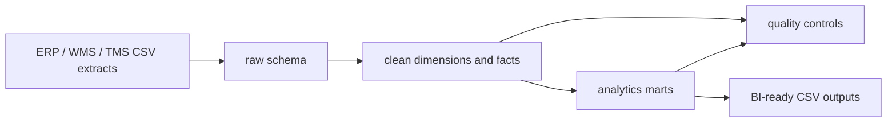

# Cloud Warehouse Analytics Lab

An executable portfolio lab that uses DuckDB as a local analytical warehouse and maps the same design to Snowflake, BigQuery, Databricks, Amazon Redshift, and Azure Synapse patterns.

The repository includes its own deterministic generator using the same ERP/WMS/TMS-style source contract as the companion `supply-chain-operations-control-tower` project. It does not require a cross-repository checkout.

> **Portfolio framing:** this is a local simulation plus cloud-ready design patterns. It does not claim production deployment experience on every platform.

## Evidence demonstrated

- Raw → clean → dimensional facts → analytical marts
- Advanced SQL: layered CTEs, windows, rolling metrics, ranking, percentiles, grain controls, and reconciliation
- Executable DuckDB warehouse and BI-ready CSV outputs
- Snowflake-style `QUALIFY`, `FLATTEN`, `MERGE`, RBAC, and cost design
- BigQuery-ready partitioning, clustering, `ARRAY<STRUCT>`, `UNNEST`, `SAFE_CAST`, and `MERGE`
- Databricks/PySpark bronze-silver-gold examples
- Redshift and Synapse CTAS/distribution patterns
- Automated quality gates and tests

## Architecture



## Quick start

```bash
python -m venv .venv
source .venv/bin/activate        # Windows: .venv\Scripts\activate
python -m pip install -r requirements.txt
make verify
```

## Generated outputs

`make verify` recreates the source extracts and outputs from a clean checkout. Generated CSV and DuckDB files are intentionally ignored by Git; GitHub Actions uploads the complete `outputs/` directory as the `cloud-warehouse-evidence` artifact.

- `outputs/warehouse.duckdb`
- `outputs/mart_order_fulfillment.csv`
- `outputs/mart_daily_service_level.csv`
- `outputs/mart_carrier_performance.csv`
- `outputs/mart_inventory_risk.csv`
- `outputs/mart_forecast_accuracy.csv`
- `outputs/data_quality_report.csv`


## Repository structure

```text
data/generate_synthetic_data.py     deterministic source generator
data/source/                        generated ERP/WMS/TMS-style extracts
duckdb_local_simulator/             canonical local warehouse runtime
duckdb_local_simulator/sql/         clean, dimensional, mart and quality SQL
validation/                         independent exported-output checks
tests/                              build, contract and reproducibility tests
outputs/                            generated database and BI-ready evidence
snowflake/ bigquery/ databricks/    provider-specific implementation patterns
redshift_synapse/                   warehouse comparison and SQL patterns
```

## Business questions answered

- Where is rolling OTIF deteriorating?
- Which carriers combine high service with low freight cost per kg?
- Which SKU-location combinations are at stockout or excess-inventory risk?
- Where is forecast bias creating service or working-capital risk?
- Do source and mart totals reconcile?

## Preserved focused examples

The canonical runtime is `duckdb_local_simulator/build_warehouse.py`. Earlier focused examples remain available for review without replacing that runtime:

- `duckdb_local_simulator/local_warehouse_pipeline.py`: small DuckDB/SQLite order-mart example.
- `docs/order_mart_validation.md`: lifecycle, allocation and validation contract.
- `bigquery/sql/order_mart_pattern.sql`: focused BigQuery order-item and customer-lifecycle pattern.
- `snowflake/sql/analytics_mart_patterns.sql`: focused Snowflake order-item and lifecycle pattern.

## Validation standard

A valid build requires unique business grains, source-to-fact row and revenue reconciliation, service metrics between 0 and 1, OTIF consistent with its component flags, non-empty marts, deterministic byte-identical CSV exports across two clean builds, and passing tests.

## AI-augmented workflow

AI accelerated SQL drafting, cross-dialect translation, documentation, and test scaffolding. Human review owns grain definitions, KPI logic, platform-specific claims, reconciliation rules, and final validation.
