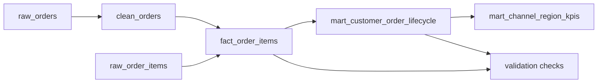

# Order Mart Validation Lab

This artifact demonstrates a cloud warehouse analytics pattern using synthetic order and order-item data. It is designed for portfolio review, not as a claim of production warehouse ownership.

## Business Question

How should a warehouse mart expose order-line revenue, customer lifecycle, and channel/region performance while keeping validation rules visible to analysts and hiring managers?

## Lineage



## KPI Dictionary

| KPI / field | Definition | Why it matters |
| --- | --- | --- |
| `net_line_amount` | Item gross amount less allocated order discount. | Preserves order-item grain while tying back to order-level net amount. |
| `recognized_line_revenue_amount` | Net line amount for shipped or delivered orders; zero for placed, cancelled, and returned orders. | Prevents dashboards from recognizing revenue on open or exception orders. |
| `customer_order_number` | `row_number()` over each customer's order history. | Supports cohort, retention, and lifecycle analysis. |
| `customer_order_stage` | `new`, `returning`, or `reactivated` based on prior order gap. | Converts order history into stakeholder-friendly segmentation. |
| `customer_revenue_to_date` | Running recognized revenue by customer. | Enables customer value and segmentation analysis. |
| `exception_order_count` | Count of cancelled and returned orders. | Keeps operational exceptions visible instead of filtering them away. |
| `avg_days_to_ship` | Average days between order date and shipped date. | Shows fulfillment performance by channel and region. |

## Warehouse Portability Notes

| Concern | Snowflake pattern | BigQuery pattern |
| --- | --- | --- |
| Physical design | `cluster by (order_date, customer_id)` on the fact table. | `partition by order_date` and `cluster by customer_id, region, product_category`. |
| Defensive casting | `try_to_date`, numeric casts, and status standardization. | `safe_cast`, `safe_divide`, and status standardization. |
| Date math | `datediff('day', start_date, end_date)`. | `date_diff(end_date, start_date, day)`. |
| Allocation safety | `nullif` and `coalesce` guard against divide-by-zero allocation. | `safe_divide` guards against divide-by-zero allocation. |
| BI readiness | Fact and lifecycle marts expose stable business fields and validation queries. | Same mart shape with BigQuery physical design syntax. |

## Validation Contract

Each validation query should return zero rows before dashboard consumption:

- `unique_order_item_grain`: no duplicate `order_id` + `sku` rows.
- `non_negative_financials`: allocated discounts, net line amount, and recognized revenue cannot be negative.
- `forward_moving_lifecycle_dates`: shipped/delivered dates cannot move backward.
- `line_allocation_ties_to_order_net_amount`: allocated item lines must tie back to order net amount within rounding tolerance.
- `customer_sequence_is_gapless`: customer order sequence must match the window-function order.

## Local Review

Run the local simulator:

```bash
python duckdb_local_simulator/local_warehouse_pipeline.py
```

The script uses DuckDB if installed and falls back to SQLite if not. A successful run prints a KPI summary and the number of validation checks executed.

## Assumptions And Limits

- Data is synthetic and intentionally small for human review.
- `total_amount` is assumed to equal the sum of item gross amounts.
- Discounts are allocated proportionally by item gross amount.
- Revenue is recognized only when order status is `shipped` or `delivered`.
- A customer is considered `reactivated` after more than 60 days since the prior order.
- Freight is retained as an order attribute but not allocated into recognized revenue in this lab.
